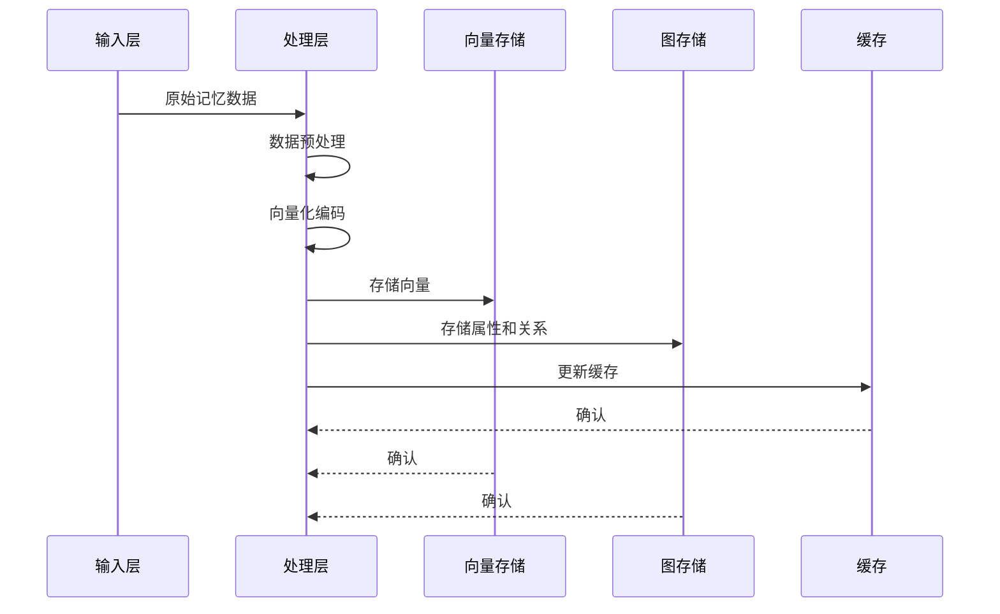
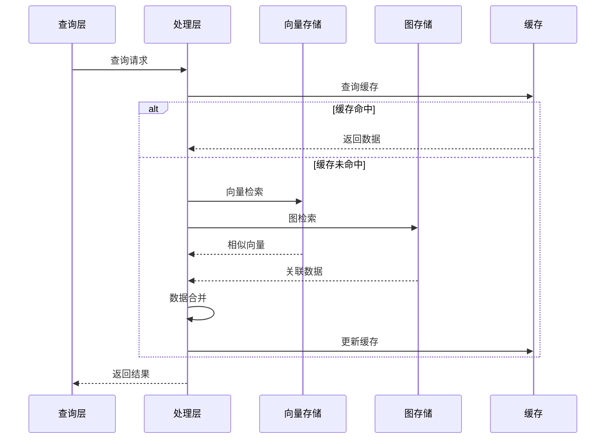
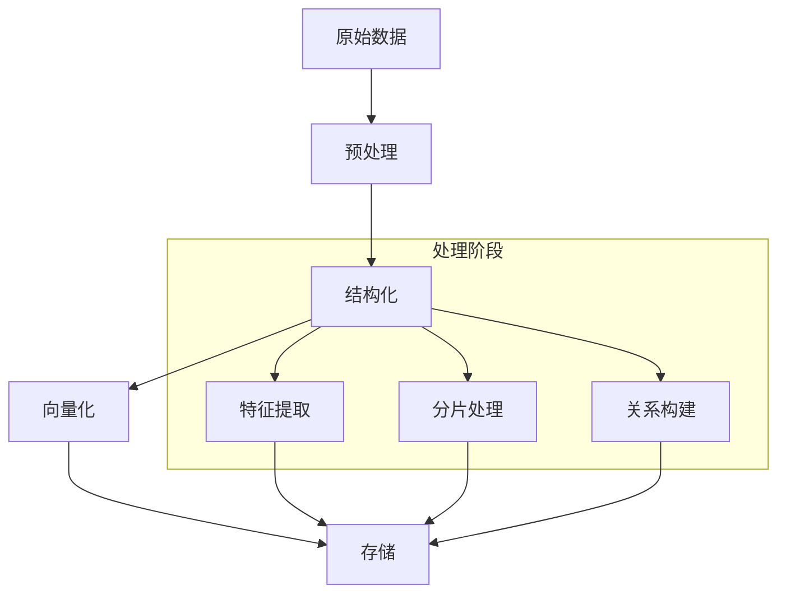
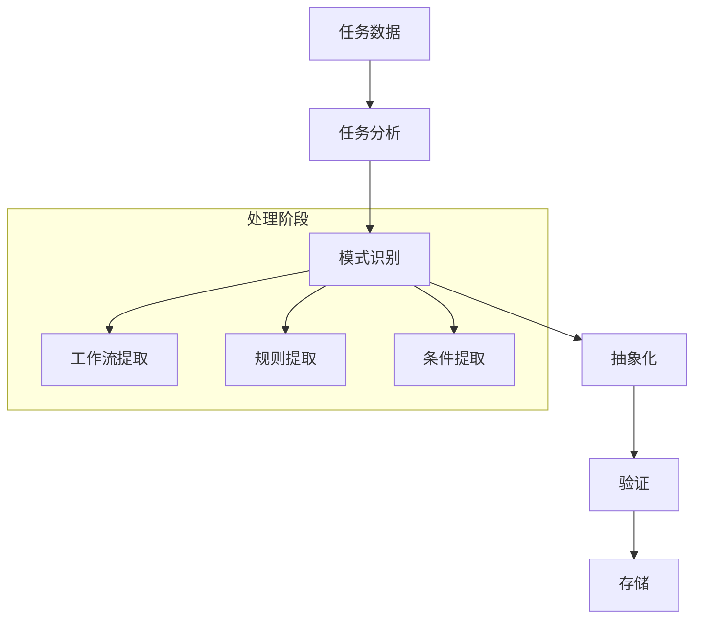
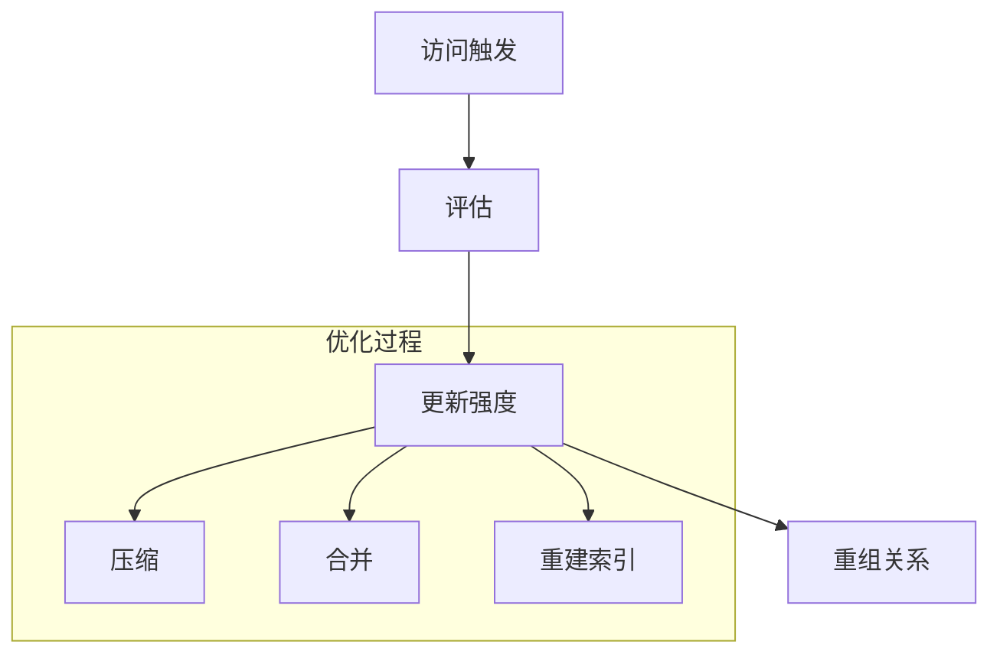
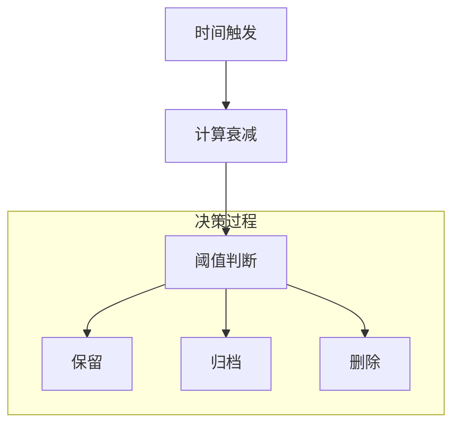
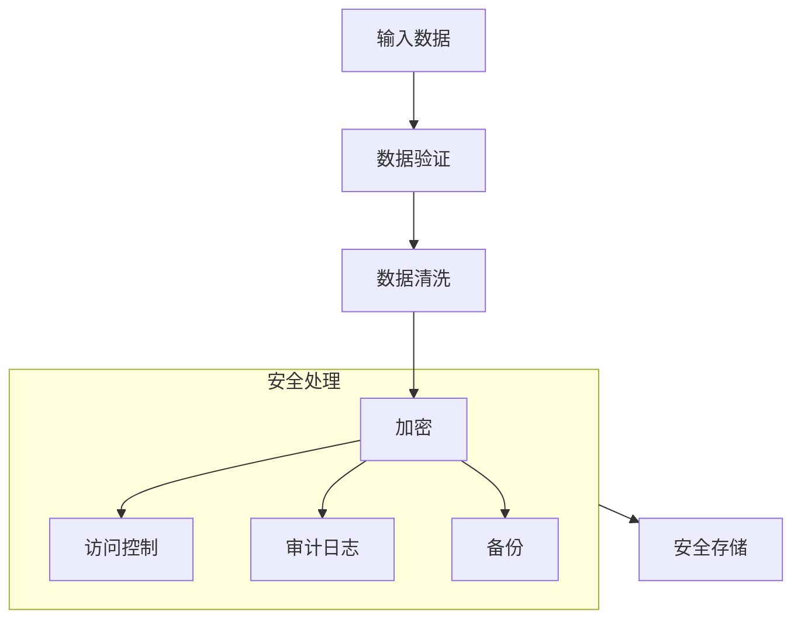

# 数据流设计

## 1. 数据结构设计

### 1.1 记忆数据结构

```python
# 基础记忆结构
class MemoryBase:
    id: str                     # 记忆唯一标识
    timestamp: datetime         # 创建时间
    last_access: datetime       # 最后访问时间
    importance: float          # 重要性得分
    embedding: np.ndarray      # 向量表示(FAISS存储)
    metadata: Dict             # 元数据

# 常规记忆结构
class RegularMemory(MemoryBase):
    content: str               # 记忆内容
    context: str              # 上下文信息
    fragments: List[str]      # 记忆片段
    relations: List[str]      # 关联记忆ID(Neo4j关系)

# 技能记忆结构
class SkillMemory(MemoryBase):
    task_type: str            # 任务类型
    workflow: List[str]       # 工作流步骤
    conditions: List[str]     # 适用条件
    success_rate: float       # 成功率
    related_skills: List[str] # 关联技能(Neo4j关系)
```

### 1.2 存储映射结构

```python
# FAISS存储结构
class FAISSVector:
    id: str                   # 向量ID
    vector: np.ndarray        # 向量数据(维度768)
    type: str                # 记忆类型(regular/skill)

# Neo4j节点结构
class MemoryNode:
    id: str                   # 节点ID(与FAISS ID对应)
    type: str                # 节点类型(regular/skill)
    properties: Dict         # 节点属性(除向量外的所有属性)

# Neo4j关系结构
class MemoryRelation:
    source_id: str           # 源节点ID
    target_id: str           # 目标节点ID
    type: str               # 关系类型
    properties: Dict        # 关系属性

# Redis缓存结构
class MemoryCache:
    key: str                # 缓存键(memory:{id})
    value: Dict            # 完整记忆数据
    ttl: int              # 过期时间
```

### 1.3 数据映射规则

1. 向量数据(FAISS)：
- 存储所有记忆的向量表示
- 用于相似度检索
- 维度固定为768

2. 图数据(Neo4j)：
- 存储记忆的属性和关系
- 用于关系查询和图分析
- 与FAISS通过ID关联

3. 缓存数据(Redis)：
- 存储热点记忆的完整数据
- 加速频繁访问的记忆
- 采用LRU策略管理

## 2. 数据流转过程

### 2.1 写入流程



### 2.2 读取流程



## 3. 数据处理流程

### 3.1 常规记忆处理



### 3.2 技能记忆处理



## 4. 数据优化流程

### 4.1 记忆强化



### 4.2 记忆衰减



## 5. 数据安全流程

