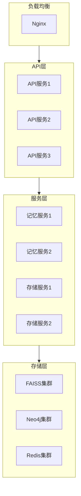
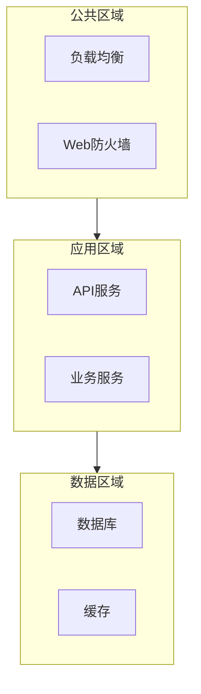
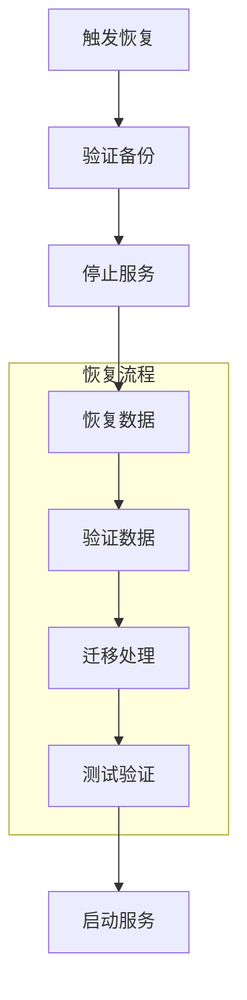

# 部署设计

## 1. 部署架构

### 1.1 整体架构



### 1.2 网络架构



## 2. 容器化配置

### 2.1 Docker配置

```yaml
# API服务
api_service:
  image: memory_system/api:latest
  ports:
    - "8000:8000"
  environment:
    - ENV=production
    - DB_HOST=db
  volumes:
    - api_data:/data
  depends_on:
    - db
    - cache

# 记忆服务
memory_service:
  image: memory_system/memory:latest
  environment:
    - FAISS_HOST=faiss
    - NEO4J_HOST=neo4j
  volumes:
    - memory_data:/data
  depends_on:
    - faiss
    - neo4j

# 存储服务
storage_service:
  image: memory_system/storage:latest
  environment:
    - REDIS_HOST=redis
  volumes:
    - storage_data:/data
  depends_on:
    - redis
```

### 2.2 Kubernetes配置

```yaml
# API部署
apiVersion: apps/v1
kind: Deployment
metadata:
  name: api-deployment
spec:
  replicas: 3
  selector:
    matchLabels:
      app: api
  template:
    metadata:
      labels:
        app: api
    spec:
      containers:
      - name: api
        image: memory_system/api:latest
        ports:
        - containerPort: 8000
        resources:
          limits:
            cpu: "1"
            memory: "1Gi"
          requests:
            cpu: "0.5"
            memory: "512Mi"
```

## 3. 扩展策略

### 3.1 水平扩展

```python
# 扩展配置
class ScalingConfig:
    # 自动扩展
    auto_scaling: Dict = {
        "min_replicas": 2,
        "max_replicas": 10,
        "target_cpu_utilization": 70,
        "target_memory_utilization": 80
    }
    
    # 手动扩展
    manual_scaling: Dict = {
        "api_replicas": 3,
        "memory_replicas": 2,
        "storage_replicas": 2
    }
```

### 3.2 存储扩展

```python
# 存储扩展
class StorageScaling:
    # FAISS配置
    faiss_scaling: Dict = {
        "shards": 3,
        "replicas": 2,
        "index_size_limit": "100GB"
    }
    
    # Neo4j配置
    neo4j_scaling: Dict = {
        "core_servers": 3,
        "read_replicas": 2
    }
    
    # Redis配置
    redis_scaling: Dict = {
        "master_replicas": 3,
        "slave_replicas": 2
    }
```

## 4. 监控和运维

### 4.1 监控配置

```yaml
# Prometheus配置
prometheus:
  global:
    scrape_interval: 15s
    evaluation_interval: 15s
  
  scrape_configs:
    - job_name: 'api'
      static_configs:
        - targets: ['api:8000']
    
    - job_name: 'memory'
      static_configs:
        - targets: ['memory:8001']
    
    - job_name: 'storage'
      static_configs:
        - targets: ['storage:8002']
```

### 4.2 日志配置

```yaml
# Elasticsearch配置
elasticsearch:
  cluster:
    name: memory-system
    nodes: 3
  
  indices:
    - name: api-logs
      retention: 30d
    - name: memory-logs
      retention: 30d
    - name: storage-logs
      retention: 30d
```

## 5. 备份和恢复

### 5.1 备份策略

```python
# 备份配置
class BackupConfig:
    # 数据备份
    data_backup: Dict = {
        "schedule": "0 0 * * *",  # 每天
        "retention": 7,           # 保留7天
        "type": "incremental"     # 增量备份
    }
    
    # 配置备份
    config_backup: Dict = {
        "schedule": "0 0 * * 0",  # 每周
        "retention": 4,           # 保留4周
        "type": "full"           # 全量备份
    }
```

### 5.2 恢复流程



## 6. 发布流程

### 6.1 发布策略

```python
# 发布配置
class DeploymentConfig:
    # 发布策略
    strategy: Dict = {
        "type": "rolling_update",
        "max_surge": 1,
        "max_unavailable": 0
    }
    
    # 健康检查
    health_check: Dict = {
        "initial_delay": 30,
        "period": 10,
        "timeout": 5,
        "success_threshold": 1,
        "failure_threshold": 3
    }
```

### 6.2 回滚策略

```python
# 回滚配置
class RollbackConfig:
    # 触发条件
    conditions: List[str] = [
        "health_check_failed",
        "error_rate_threshold",
        "manual_trigger"
    ]
    
    # 回滚设置
    settings: Dict = {
        "timeout": 300,
        "batch_size": 1,
        "pause_time": 30
    }
``` 