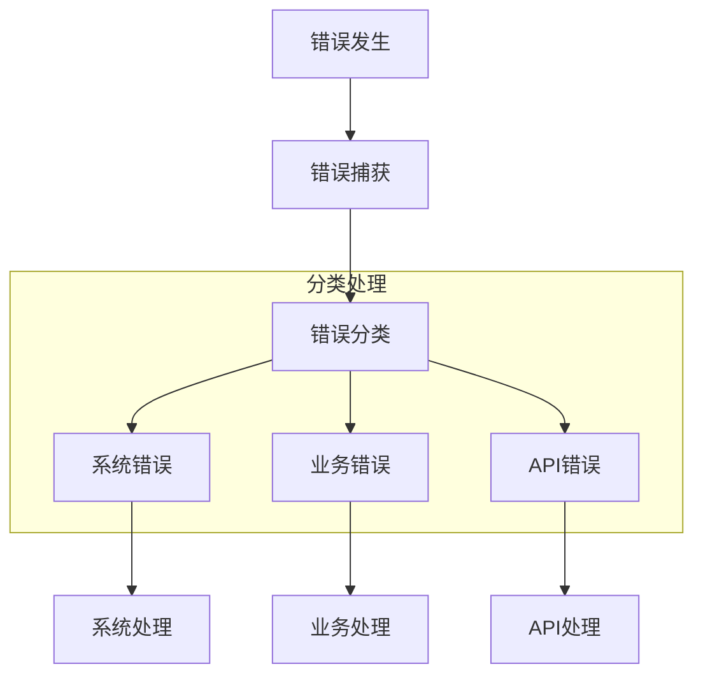
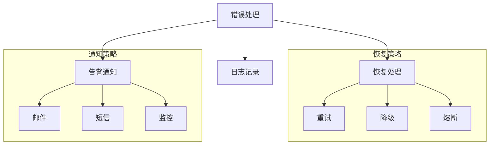
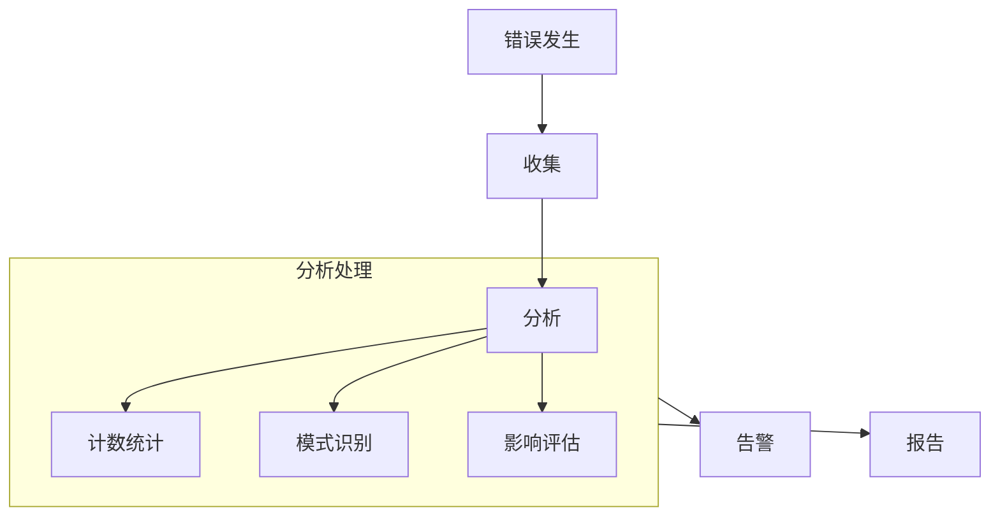

# 错误处理设计

## 1. 错误分类

### 1.1 系统错误

```python
class SystemError(BaseException):
    """系统级错误基类"""
    code: int                # 错误码
    message: str            # 错误信息
    timestamp: datetime     # 发生时间
    trace_id: str          # 追踪ID

# 存储错误
class StorageError(SystemError):
    storage_type: str      # 存储类型(FAISS/Neo4j/Redis)
    operation: str         # 操作类型(read/write/delete)
    details: Dict          # 详细信息

# 网络错误
class NetworkError(SystemError):
    service: str           # 服务名称
    endpoint: str          # 接口地址
    status_code: int       # 状态码

# 资源错误
class ResourceError(SystemError):
    resource_type: str     # 资源类型
    resource_id: str       # 资源标识
    limit: float          # 限制值
    current: float        # 当前值
```

### 1.2 业务错误

```python
class BusinessError(BaseException):
    """业务级错误基类"""
    code: int                # 错误码
    message: str            # 错误信息
    context: Dict           # 业务上下文

# 记忆处理错误
class MemoryProcessError(BusinessError):
    memory_type: str        # 记忆类型
    process_stage: str      # 处理阶段
    input_data: Dict        # 输入数据

# 参数验证错误
class ValidationError(BusinessError):
    field: str             # 字段名
    value: Any             # 错误值
    constraint: str        # 约束条件

# 业务逻辑错误
class LogicError(BusinessError):
    operation: str         # 操作名称
    reason: str           # 失败原因
    suggestions: List[str] # 建议解决方案
```

### 1.3 接口错误

```python
class APIError(BaseException):
    """API接口错误基类"""
    status_code: int        # HTTP状态码
    error_code: int         # 业务错误码
    message: str           # 错误信息
    details: Dict          # 详细信息

# 请求错误
class RequestError(APIError):
    invalid_params: Dict    # 无效参数
    missing_params: List    # 缺失参数
    
# 响应错误
class ResponseError(APIError):
    expected_type: str      # 期望类型
    actual_type: str       # 实际类型
    data: Dict             # 响应数据
```

## 2. 错误处理流程

### 2.1 错误捕获



### 2.2 错误处理策略



## 3. 错误响应规范

### 3.1 API错误响应

```python
# 标准错误响应
class ErrorResponse:
    status: int           # HTTP状态码
    code: int            # 业务错误码
    message: str         # 错误信息
    details: Dict        # 详细信息
    trace_id: str       # 追踪ID
    timestamp: datetime  # 响应时间

# 错误码映射
ERROR_CODES = {
    # 系统错误 (1000-1999)
    1000: "系统内部错误",
    1001: "存储服务错误",
    1002: "网络服务错误",
    1003: "资源限制错误",
    
    # 业务错误 (2000-2999)
    2000: "业务处理错误",
    2001: "记忆处理错误",
    2002: "参数验证错误",
    2003: "业务逻辑错误",
    
    # API错误 (3000-3999)
    3000: "API调用错误",
    3001: "请求参数错误",
    3002: "响应格式错误",
    3003: "认证授权错误"
}
```

### 3.2 错误日志格式

```python
# 日志结构
class ErrorLog:
    level: str           # 日志级别
    timestamp: datetime  # 时间戳
    trace_id: str       # 追踪ID
    error_type: str     # 错误类型
    error_code: int     # 错误码
    message: str        # 错误信息
    stack_trace: str    # 堆栈信息
    context: Dict       # 上下文信息
    metadata: Dict      # 元数据
```

## 4. 错误恢复机制

### 4.1 重试机制

```python
# 重试配置
class RetryConfig:
    max_attempts: int    # 最大重试次数
    delay: float        # 重试延迟(秒)
    backoff: float     # 退避系数
    exceptions: List    # 需要重试的异常

# 重试装饰器
@retry(config=RetryConfig)
def operation_with_retry():
    pass
```

### 4.2 降级机制

```python
# 降级配置
class FallbackConfig:
    conditions: List[str]  # 降级条件
    fallback_func: Callable # 降级函数
    timeout: float        # 超时时间

# 降级装饰器
@fallback(config=FallbackConfig)
def operation_with_fallback():
    pass
```

### 4.3 熔断机制

```python
# 熔断配置
class CircuitBreakerConfig:
    failure_threshold: int  # 失败阈值
    recovery_timeout: float # 恢复超时
    half_open_timeout: float # 半开超时

# 熔断装饰器
@circuit_breaker(config=CircuitBreakerConfig)
def operation_with_circuit_breaker():
    pass
```

## 5. 监控和告警

### 5.1 错误监控



### 5.2 告警规则

```python
# 告警配置
class AlertConfig:
    error_type: str        # 错误类型
    threshold: int         # 告警阈值
    interval: float       # 统计间隔
    channels: List[str]   # 通知渠道
    template: str         # 通知模板
```

## 6. 错误预防

### 6.1 参数验证

```python
# 验证规则
class ValidationRule:
    field: str           # 字段名
    type: str           # 数据类型
    required: bool      # 是否必需
    constraints: List   # 约束条件
    custom_check: Callable # 自定义检查

# 验证装饰器
@validate(rules=List[ValidationRule])
def operation_with_validation():
    pass
```

### 6.2 状态检查

```python
# 状态检查
class HealthCheck:
    service: str         # 服务名称
    check_func: Callable # 检查函数
    interval: float     # 检查间隔
    timeout: float      # 超时时间
``` 