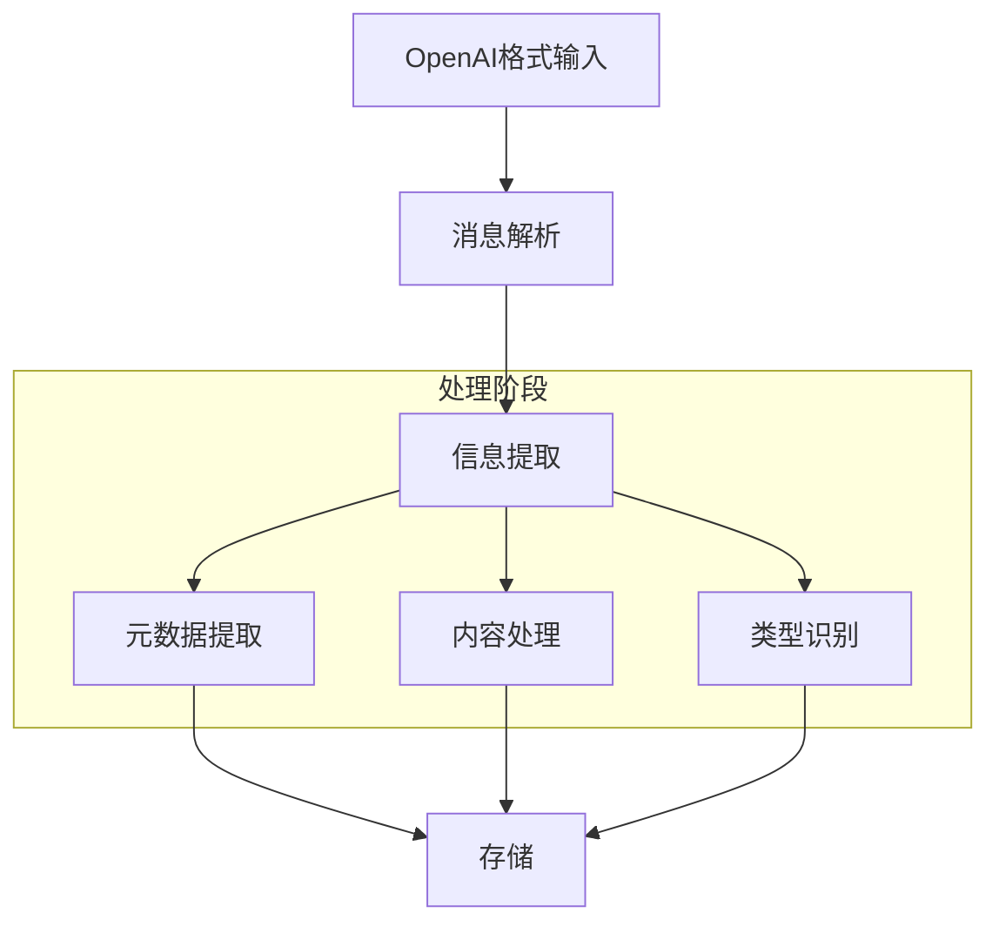
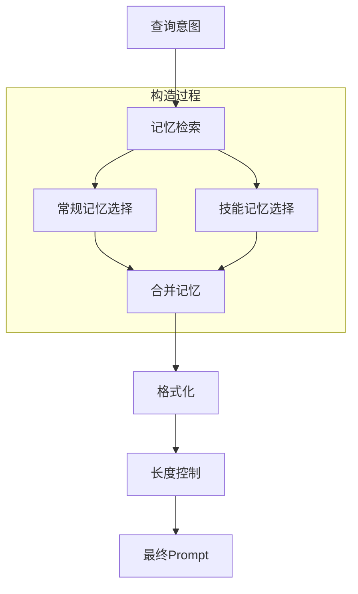
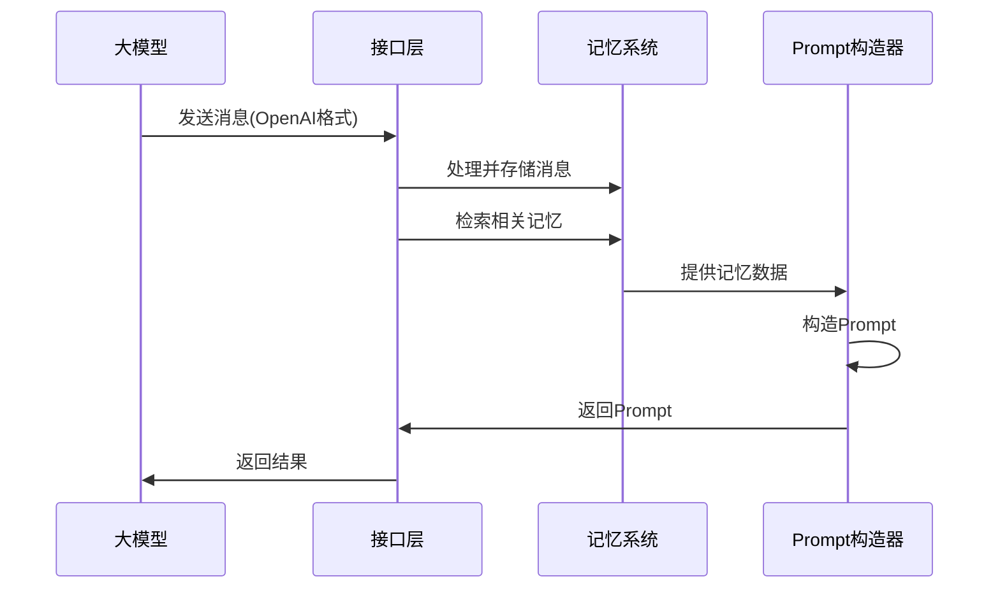
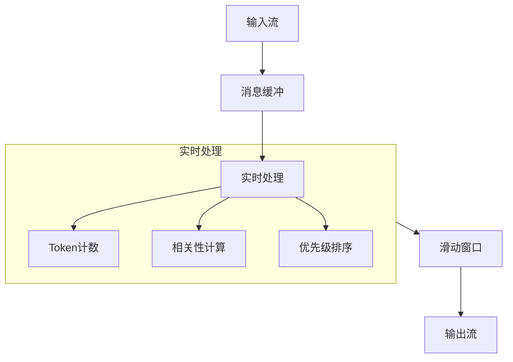
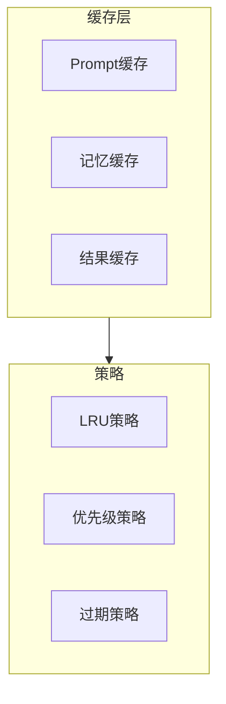
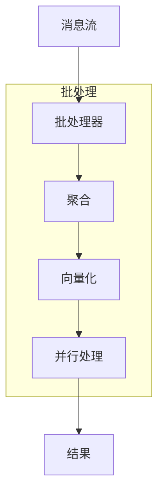

# LLM接口设计

## 1. 输入接口设计

### 1.1 消息结构

```python
# 基础消息结构
class Message:
    role: str                # 角色: system/user/assistant
    content: str             # 消息内容
    timestamp: datetime      # 时间戳
    metadata: Dict           # 元数据

# 对话历史结构
class Conversation:
    id: str                 # 对话ID
    messages: List[Message] # 消息列表
    system_prompt: str      # 系统提示
    metadata: Dict          # 元数据(如domain、task等)

# 多模态消息结构
class MultiModalMessage(Message):
    content_type: str       # 内容类型: text/image/audio
    content_format: str     # 格式: base64/url/text
    content_data: Any       # 实际内容
```

### 1.2 输入处理流程



## 2. 输出设计

### 2.1 Prompt结构

```python
# Prompt组件
class PromptComponent:
    type: str              # 组件类型: context/memory/instruction
    content: str           # 组件内容
    priority: float        # 优先级
    tokens: int           # token数量

# Prompt模板
class PromptTemplate:
    components: List[PromptComponent]  # 组件列表
    max_tokens: int                    # 最大token数
    format: str                        # 格式化方式

# 记忆Prompt
class MemoryPrompt:
    regular_memories: List[str]        # 相关常规记忆
    skill_memories: List[str]          # 相关技能记忆
    context_window: int                # 上下文窗口大小
```

### 2.2 Prompt构造流程



## 3. 交互流程

### 3.1 基本流程



### 3.2 实时处理流程



## 4. API规范

### 4.1 OpenAI兼容接口

```python
# Chat完成请求
class ChatCompletionRequest:
    model: str
    messages: List[Message]
    temperature: float = 0.7
    max_tokens: int = 1000
    stream: bool = False
    
# Chat完成响应
class ChatCompletionResponse:
    id: str
    object: str = "chat.completion"
    created: int
    model: str
    choices: List[Dict]
    usage: Dict
```

### 4.2 记忆增强接口

```python
# 记忆增强请求
class MemoryEnhancedRequest(ChatCompletionRequest):
    memory_config: Dict = {
        "use_regular_memory": True,
        "use_skill_memory": True,
        "max_memories": 5,
        "memory_threshold": 0.7
    }
    
# 记忆增强响应
class MemoryEnhancedResponse(ChatCompletionResponse):
    memories_used: List[str]  # 使用的记忆ID列表
    memory_stats: Dict       # 记忆使用统计
```

## 5. 性能优化

### 5.1 缓存策略



### 5.2 批处理优化

