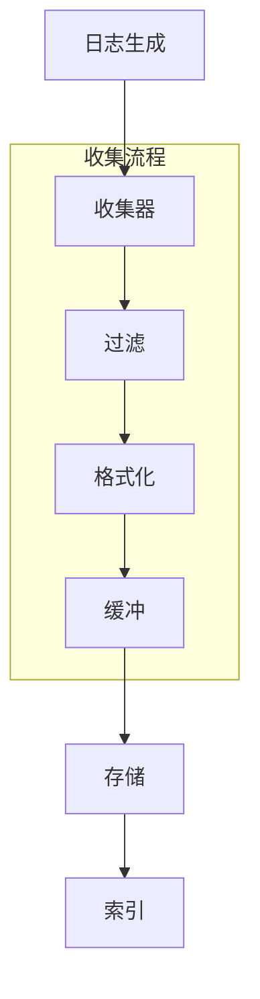
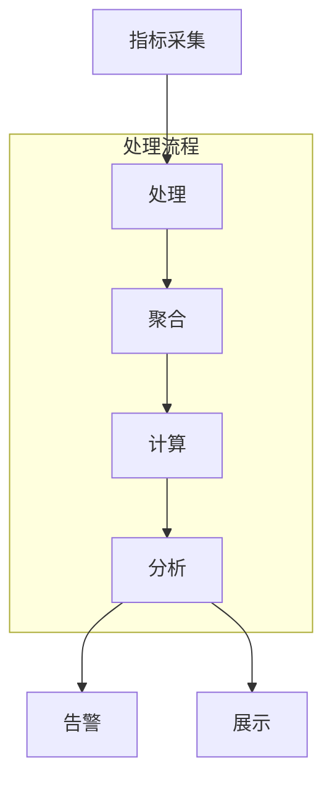
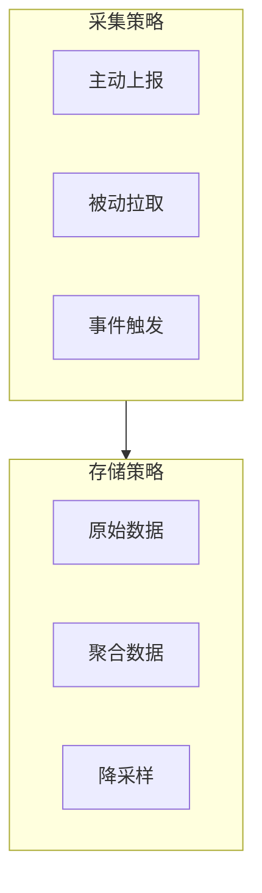

# 监控和日志设计

## 1. 监控指标

### 1.1 系统指标

```python
# 系统监控指标
class SystemMetrics:
    # CPU指标
    cpu_usage: float          # CPU使用率
    cpu_load: float          # CPU负载
    
    # 内存指标
    memory_usage: float      # 内存使用率
    memory_available: float  # 可用内存
    
    # 磁盘指标
    disk_usage: float        # 磁盘使用率
    disk_io: float          # 磁盘IO
    
    # 网络指标
    network_in: float       # 网络入流量
    network_out: float      # 网络出流量
    
    # 进程指标
    process_count: int      # 进程数
    thread_count: int       # 线程数
```

### 1.2 业务指标

```python
# 记忆系统指标
class MemoryMetrics:
    # 存储指标
    total_memories: int     # 总记忆数
    memory_size: float     # 存储大小
    index_size: float      # 索引大小
    
    # 性能指标
    write_qps: float       # 写入QPS
    read_qps: float        # 读取QPS
    avg_latency: float     # 平均延迟
    
    # 质量指标
    accuracy: float        # 检索准确率
    recall: float         # 检索召回率
    
    # 资源指标
    vector_count: int     # 向量数量
    graph_nodes: int      # 图节点数
    graph_edges: int      # 图边数

# API指标
class APIMetrics:
    # 请求指标
    requests_total: int    # 总请求数
    requests_success: int  # 成功请求数
    requests_error: int   # 错误请求数
    
    # 性能指标
    avg_response_time: float  # 平均响应时间
    p95_response_time: float  # P95响应时间
    p99_response_time: float  # P99响应时间
    
    # 并发指标
    concurrent_requests: int   # 并发请求数
    max_concurrent: int       # 最大并发数
```

## 2. 日志系统

### 2.1 日志分类

```python
# 系统日志
class SystemLog:
    level: str           # 日志级别
    timestamp: datetime  # 时间戳
    component: str       # 组件名称
    event: str          # 事件描述
    details: Dict       # 详细信息

# 访问日志
class AccessLog:
    timestamp: datetime  # 时间戳
    client_ip: str      # 客户端IP
    method: str         # 请求方法
    path: str           # 请求路径
    status: int         # 状态码
    response_time: float # 响应时间
    user_agent: str     # 用户代理

# 业务日志
class BusinessLog:
    timestamp: datetime  # 时间戳
    operation: str      # 操作类型
    user_id: str        # 用户ID
    resource: str       # 资源
    result: str        # 结果
    context: Dict      # 上下文
```

### 2.2 日志收集



## 3. 监控系统

### 3.1 实时监控



### 3.2 监控配置

```python
# 监控配置
class MonitorConfig:
    # 采集配置
    collect_interval: float   # 采集间隔
    metrics_buffer: int      # 指标缓冲
    
    # 告警配置
    alert_rules: List[Rule]  # 告警规则
    alert_channels: List[str] # 告警渠道
    
    # 存储配置
    storage_type: str        # 存储类型
    retention: str          # 保留时间

# 告警规则
class AlertRule:
    metric: str            # 指标名称
    condition: str         # 条件
    threshold: float       # 阈值
    duration: str         # 持续时间
    severity: str         # 严重程度
```

## 4. 可视化

### 4.1 仪表盘

```python
# 仪表盘配置
class DashboardConfig:
    # 布局配置
    layout: List[Panel]     # 面板布局
    refresh_interval: int   # 刷新间隔
    
    # 数据配置
    data_source: str       # 数据源
    time_range: str        # 时间范围
    
    # 显示配置
    theme: str            # 主题
    variables: Dict       # 变量

# 面板配置
class PanelConfig:
    title: str           # 标题
    type: str           # 类型(图表/表格等)
    metrics: List[str]   # 指标列表
    visualization: Dict  # 可视化配置
```

### 4.2 报表系统

```python
# 报表配置
class ReportConfig:
    # 基本配置
    name: str            # 报表名称
    schedule: str        # 调度周期
    format: str         # 输出格式
    
    # 内容配置
    sections: List[Section] # 报表章节
    metrics: List[str]     # 统计指标
    
    # 发送配置
    recipients: List[str]  # 接收人
    channels: List[str]    # 发送渠道
```

## 5. 监控策略

### 5.1 采集策略



### 5.2 告警策略

```python
# 告警策略
class AlertStrategy:
    # 基本策略
    check_interval: float   # 检查间隔
    recovery_interval: float # 恢复检查间隔
    
    # 抑制策略
    silence_duration: float # 抑制时间
    group_wait: float      # 分组等待
    
    # 升级策略
    escalation_levels: List[Level] # 升级级别
    auto_resolve: bool            # 自动解决
```

## 6. 运维工具

### 6.1 日志分析

```python
# 日志分析工具
class LogAnalyzer:
    # 分析功能
    pattern_match: bool    # 模式匹配
    error_detect: bool     # 错误检测
    trend_analyze: bool    # 趋势分析
    
    # 统计功能
    count_frequency: bool  # 频率统计
    time_distribution: bool # 时间分布
    error_category: bool   # 错误分类
```

### 6.2 性能分析

```python
# 性能分析工具
class PerformanceAnalyzer:
    # 分析维度
    latency_analysis: bool  # 延迟分析
    resource_usage: bool    # 资源使用
    bottleneck_detect: bool # 瓶颈检测
    
    # 优化建议
    optimization_suggest: bool # 优化建议
    resource_planning: bool   # 资源规划
``` 