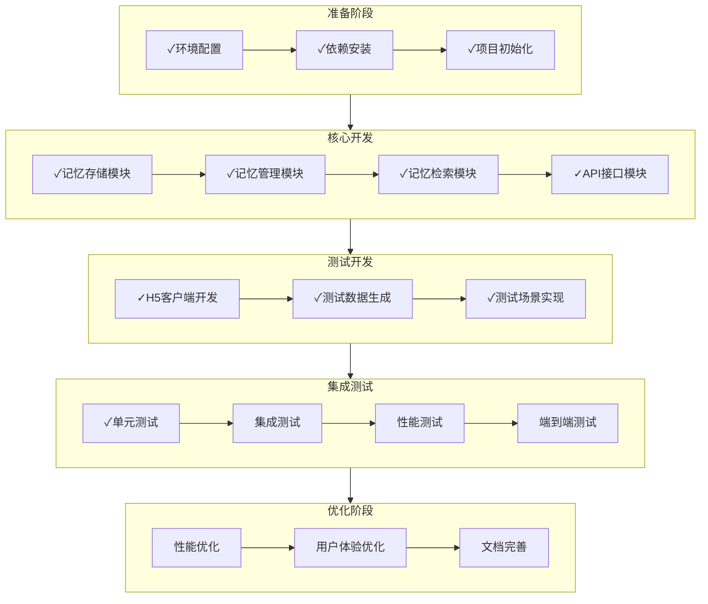
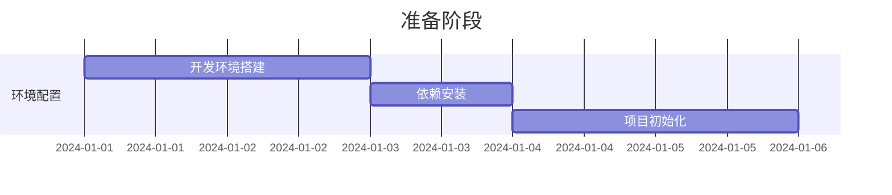
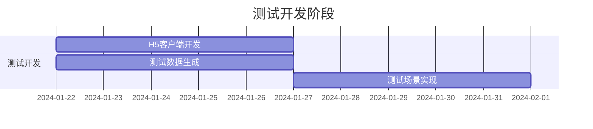
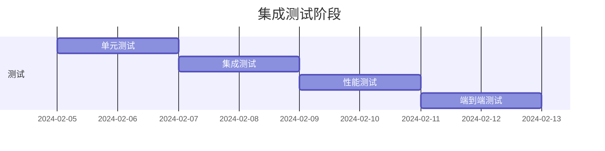
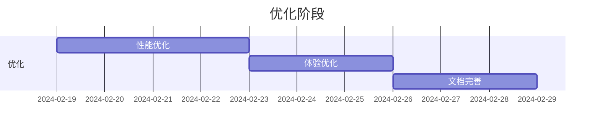

# 开发路线图

## 1. 开发流程图

## 2. 开发阶段说明

### 2.1 准备阶段 (Week 1)

#### 主要任务
1. 环境配置 [✓]
   - 开发环境搭建 [✓]
   - 测试环境搭建 [✓]
   - 版本控制配置 [✓]

2. 依赖安装 [✓]
   - 核心依赖安装 [✓]
   - 开发工具配置 [✓]
   - 测试框架配置 [✓]

3. 项目初始化 [✓]
   - 目录结构创建 [✓]
   - 基础文件配置 [✓]
   - 开发规范确认 [✓]

### 2.2 核心开发 (Week 2-3)

#### 主要任务
1. 记忆存储模块 [✓]
   - FAISS向量存储 [✓]
   - Neo4j图数据库 [✓]
   - Redis缓存层 [✓]

2. 记忆管理模块 [✓]
   - 常规记忆管理 [✓]
   - 技能记忆管理 [✓]
   - 记忆关系管理 [✓]

3. 记忆检索模块 [✓]
   - 向量检索 [✓]
   - 图检索 [✓]
   - 混合检索 [✓]

4. API接口模块 [✓]
   - REST API设计 [✓]
   - WebSocket接口 [✓]
   - 接口文档 [✓]

### 2.3 测试开发 (Week 4-5)

#### 主要任务
1. H5客户端开发 [✓]
   - 界面实现 [✓]
   - 功能实现 [✓]
   - 主题切换 [✓]
   - 错误处理 [✓]

2. 测试数据生成 [✓]
   - 数据生成器 [✓]
   - 关系生成器 [✓]
   - 数据验证器 [✓]

3. 测试场景实现 [✓]
   - 基础场景 [✓]
   - 特殊场景 [✓]
   - 性能测试场景 [✓]

### 2.4 集成测试 (Week 6)

#### 主要任务
1. 单元测试 [✓]
   - 模块测试 [✓]
   - 接口测试 [✓]
   - 功能测试 [✓]

2. 集成测试 [进行中]
   - 系统集成测试 [ ]
   - 端到端测试 [ ]
   - 压力测试 [ ]

3. 性能测试框架 [待开发]
   - 响应时间测试 [ ]
   - 并发性能测试 [ ]
   - 资源使用监控 [ ]

4. 测试报告生成 [待开发]
   - 测试结果收集 [ ]
   - 报告模板设计 [ ]
   - 可视化展示 [ ]

5. CI/CD集成 [待开发]
   - 自动化测试流程 [ ]
   - 持续集成配置 [ ]
   - 部署自动化 [ ]

### 2.5 优化阶段 (Week 7-8)

#### 主要任务
1. 性能优化 [ ]
   - 响应时间优化 [ ]
   - 资源使用优化 [ ]
   - 并发性能优化 [ ]

2. 用户体验优化 [ ]
   - 界面交互优化 [ ]
   - 错误提示优化 [ ]
   - 操作流程优化 [ ]

3. 文档完善 [ ]
   - 开发文档更新 [ ]
   - 接口文档完善 [ ]
   - 部署文档编写 [ ]

## 3. 关键里程碑

1. Week 1 末 [✓]
   - 完成环境搭建 [✓]
   - 完成项目初始化 [✓]
   - 开发规范确认 [✓]

2. Week 3 末 [✓]
   - 核心功能完成 [✓]
   - API接口完成 [✓]
   - 单元测试覆盖 [✓]

3. Week 5 末 [✓]
   - 测试客户端完成 [✓]
   - 测试数据完成 [✓]
   - 测试场景完成 [✓]

4. Week 6 末 [进行中]
   - 集成测试完成 [进行中]
   - 性能测试完成 [ ]
   - 系统稳定运行 [ ]

5. Week 8 末 [ ]
   - 性能指标达标 [ ]
   - 体验优化完成 [ ]
   - 文档完善完成 [ ]

## 4. 风险管理

### 4.1 技术风险
- 向量检索性能不达标
- 图数据库扩展性问题
- 并发处理瓶颈

### 4.2 进度风险
- 核心功能开发延期
- 测试覆盖不足
- 性能优化耗时

### 4.3 质量风险
- 测试数据不充分
- 边界情况处理
- 性能指标不达标

### 4.4 风险应对
1. 技术预研
   - 提前进行技术验证
   - 准备备选方案
   - 性能基准测试

2. 进度管理
   - 合理分配资源
   - 定期进度审查
   - 及时调整计划

3. 质量保证
   - 完善测试用例
   - 代码审查
   - 持续集成 