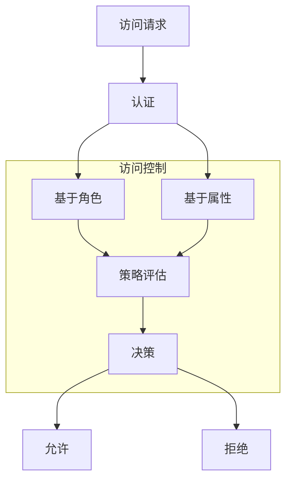
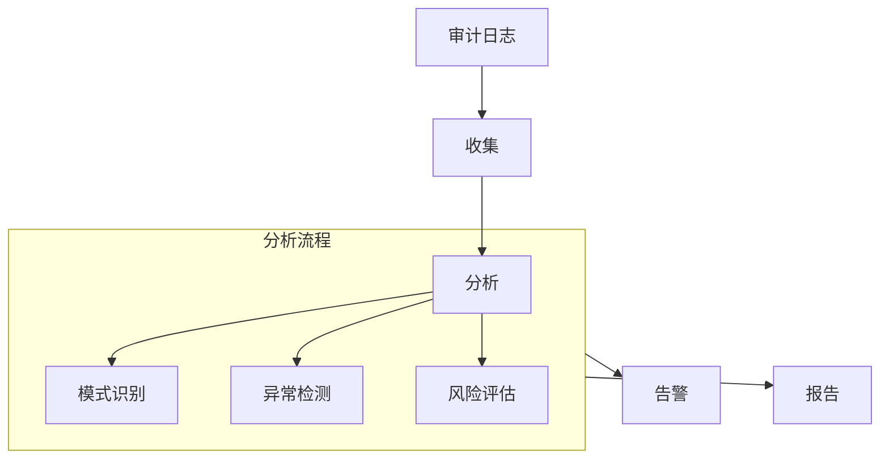

# 安全机制设计

## 1. 认证机制

### 1.1 身份认证

```python
# 认证配置
class AuthConfig:
    # 认证方式
    auth_type: str         # 认证类型(JWT/OAuth2/APIKey)
    token_expire: int      # 令牌过期时间
    refresh_enable: bool   # 是否允许刷新
    
    # 安全配置
    max_attempts: int      # 最大尝试次数
    lockout_duration: int  # 锁定时间
    password_policy: Dict  # 密码策略

# 认证令牌
class AuthToken:
    token_id: str         # 令牌ID
    user_id: str          # 用户ID
    permissions: List[str] # 权限列表
    issued_at: datetime   # 签发时间
    expires_at: datetime  # 过期时间
    metadata: Dict        # 元数据
```

### 1.2 授权机制

```python
# 角色定义
class Role:
    role_id: str          # 角色ID
    name: str            # 角色名称
    permissions: List[str] # 权限列表
    parent_role: str     # 父角色
    metadata: Dict       # 元数据

# 权限定义
class Permission:
    permission_id: str    # 权限ID
    resource: str        # 资源
    action: str         # 操作
    conditions: Dict    # 条件
```

## 2. 数据安全

### 2.1 数据加密

```python
# 加密配置
class EncryptionConfig:
    # 算法配置
    algorithm: str        # 加密算法
    key_size: int        # 密钥长度
    mode: str           # 加密模式
    
    # 密钥管理
    key_rotation: int    # 密钥轮换周期
    key_backup: bool    # 密钥备份
    
    # 范围配置
    encrypt_fields: List[str] # 加密字段
    encrypt_files: bool      # 文件加密

# 加密密钥
class EncryptionKey:
    key_id: str         # 密钥ID
    algorithm: str      # 算法
    key_data: bytes    # 密钥数据
    created_at: datetime # 创建时间
    expires_at: datetime # 过期时间
```

### 2.2 数据脱敏

```python
# 脱敏规则
class MaskingRule:
    field: str          # 字段名
    method: str         # 脱敏方法
    pattern: str        # 匹配模式
    replacement: str    # 替换内容

# 脱敏配置
class MaskingConfig:
    rules: List[MaskingRule] # 脱敏规则
    default_method: str     # 默认方法
    exclude_fields: List[str] # 排除字段
```

## 3. 访问控制

### 3.1 访问策略



### 3.2 访问控制配置

```python
# 访问控制策略
class AccessPolicy:
    # 基本信息
    policy_id: str       # 策略ID
    name: str           # 策略名称
    description: str    # 描述
    
    # 控制规则
    effect: str         # 效果(允许/拒绝)
    principals: List[str] # 主体
    actions: List[str]   # 操作
    resources: List[str] # 资源
    conditions: Dict    # 条件
```

## 4. 安全审计

### 4.1 审计日志

```python
# 审计日志
class AuditLog:
    # 基本信息
    event_id: str        # 事件ID
    timestamp: datetime  # 时间戳
    event_type: str     # 事件类型
    
    # 访问信息
    user_id: str        # 用户ID
    resource: str       # 资源
    action: str        # 操作
    result: str        # 结果
    
    # 上下文
    client_ip: str      # 客户端IP
    user_agent: str     # 用户代理
    request_id: str     # 请求ID
```

### 4.2 审计分析



## 5. 安全防护

### 5.1 防护机制

```python
# 防护配置
class SecurityDefense:
    # 限流配置
    rate_limit: Dict = {
        "requests_per_second": 10,
        "burst": 20
    }
    
    # WAF配置
    waf_rules: List[str] = [
        "sql_injection",
        "xss",
        "csrf"
    ]
    
    # DDoS防护
    ddos_protection: Dict = {
        "threshold": 1000,
        "block_duration": 300
    }
```

### 5.2 安全监控

```python
# 安全监控
class SecurityMonitor:
    # 监控项
    items: List[str] = [
        "authentication_failures",
        "suspicious_activities",
        "policy_violations"
    ]
    
    # 告警阈值
    thresholds: Dict = {
        "auth_failures": 5,
        "suspicious_ips": 3
    }
    
    # 响应动作
    actions: List[str] = [
        "block_ip",
        "disable_account",
        "notify_admin"
    ]
```

## 6. 隐私保护

### 6.1 隐私配置

```python
# 隐私设置
class PrivacySettings:
    # 数据收集
    data_collection: Dict = {
        "required_fields": [],
        "optional_fields": [],
        "retention_period": 30
    }
    
    # 数据使用
    data_usage: Dict = {
        "allowed_purposes": [],
        "restricted_purposes": []
    }
    
    # 数据共享
    data_sharing: Dict = {
        "allowed_recipients": [],
        "sharing_conditions": []
    }
```

### 6.2 隐私合规

```python
# 合规检查
class ComplianceCheck:
    # 合规要求
    requirements: List[str] = [
        "data_minimization",
        "purpose_limitation",
        "storage_limitation"
    ]
    
    # 检查项目
    checkpoints: Dict = {
        "data_collection": [],
        "data_processing": [],
        "data_retention": []
    }
    
    # 报告生成
    reporting: Dict = {
        "frequency": "monthly",
        "recipients": []
    }
``` 