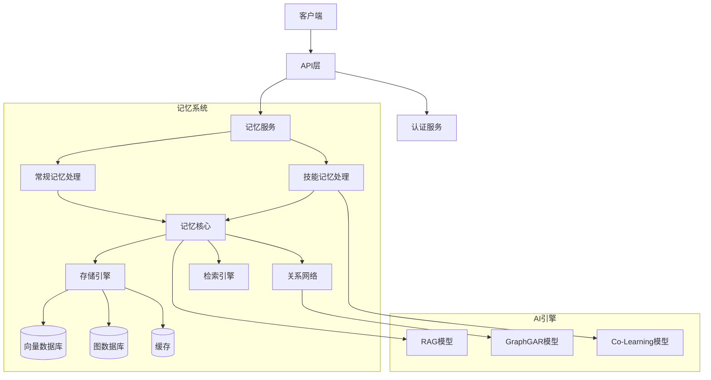
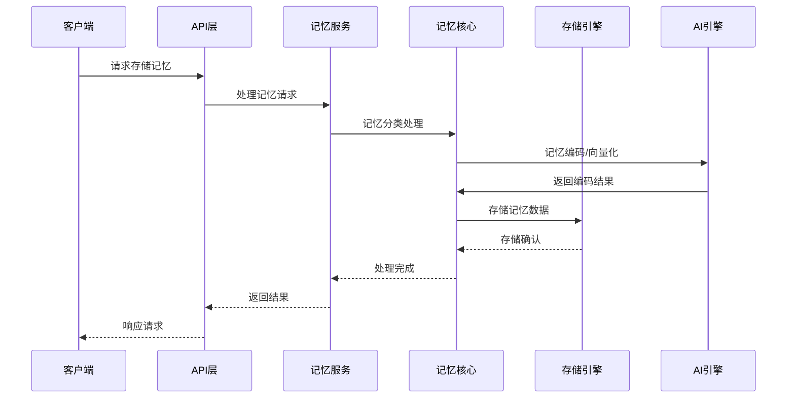
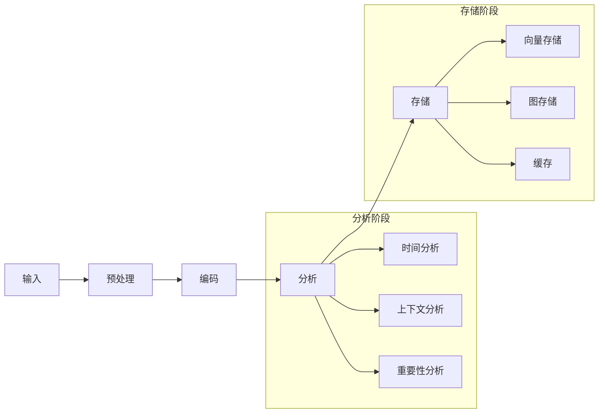
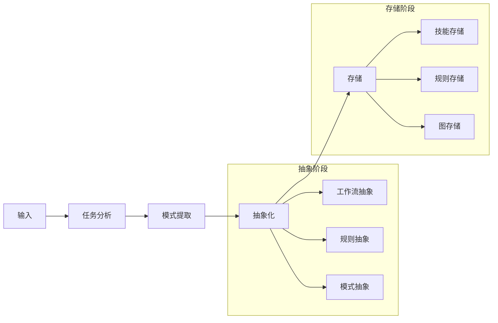
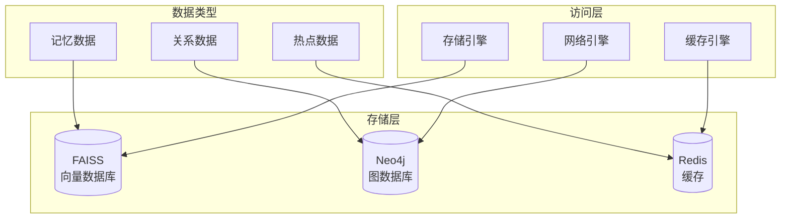
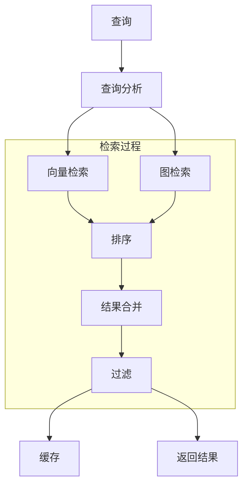
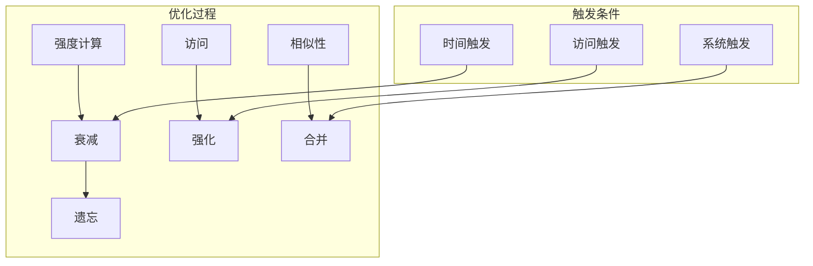

# 系统架构设计

## 1. 系统整体架构



## 2. 数据流程



## 3. 记忆处理流程

### 3.1 常规记忆处理



### 3.2 技能记忆处理



## 4. 存储架构



## 5. 检索流程



## 6. 记忆优化流程



## 7. 组件详细设计

### 7.1 核心组件

```
agent_memory_system/
├── core/
│   ├── memory/
│   │   ├── regular/
│   │   │   ├── processor.py     # 常规记忆处理器
│   │   │   ├── analyzer.py      # 记忆分析器
│   │   │   └── optimizer.py     # 记忆优化器
│   │   └── skill/
│   │       ├── processor.py     # 技能记忆处理器
│   │       ├── extractor.py     # 模式提取器
│   │       └── abstractor.py    # 抽象处理器
│   ├── storage/
│   │   ├── vector_store.py      # 向量存储
│   │   ├── graph_store.py       # 图存储
│   │   └── cache_store.py       # 缓存存储
│   ├── network/
│   │   ├── relation.py          # 关系管理
│   │   ├── graph.py            # 图操作
│   │   └── optimizer.py        # 网络优化
│   └── retrieval/
│       ├── searcher.py         # 检索器
│       ├── ranker.py          # 排序器
│       └── merger.py          # 结果合并器
```

### 7.2 服务组件

```
agent_memory_system/
├── services/
│   ├── memory_service.py       # 记忆服务
│   ├── storage_service.py      # 存储服务
│   ├── retrieval_service.py    # 检索服务
│   └── optimization_service.py # 优化服务
```

### 7.3 模型组件

```
agent_memory_system/
├── models/
│   ├── rag/
│   │   ├── encoder.py         # 编码器
│   │   ├── retriever.py       # 检索器
│   │   └── generator.py       # 生成器
│   ├── graph_gar/
│   │   ├── graph_encoder.py   # 图编码器
│   │   ├── reasoner.py       # 推理器
│   │   └── generator.py      # 生成器
│   └── co_learning/
│       ├── skill_extractor.py # 技能提取器
│       ├── pattern_learner.py # 模式学习器
│       └── transfer.py       # 迁移学习器
``` 